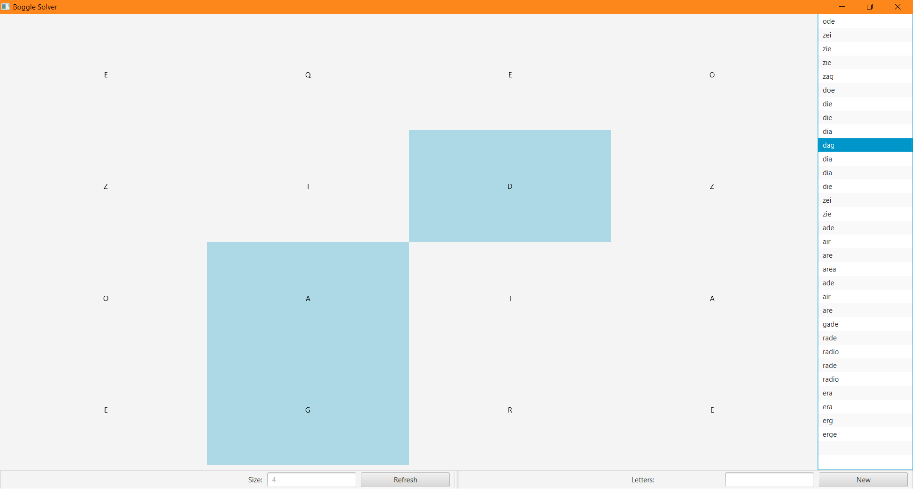
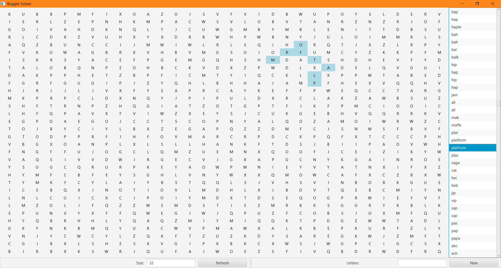

# Boggle Solver

A screenshot of the default 4x4 board.
----

A screenshot of a 32x32 board.
Still responds within a second when using a large dictionary like the [sowpods](https://en.wikipedia.org/wiki/Collins_Scrabble_Words) library (not included).